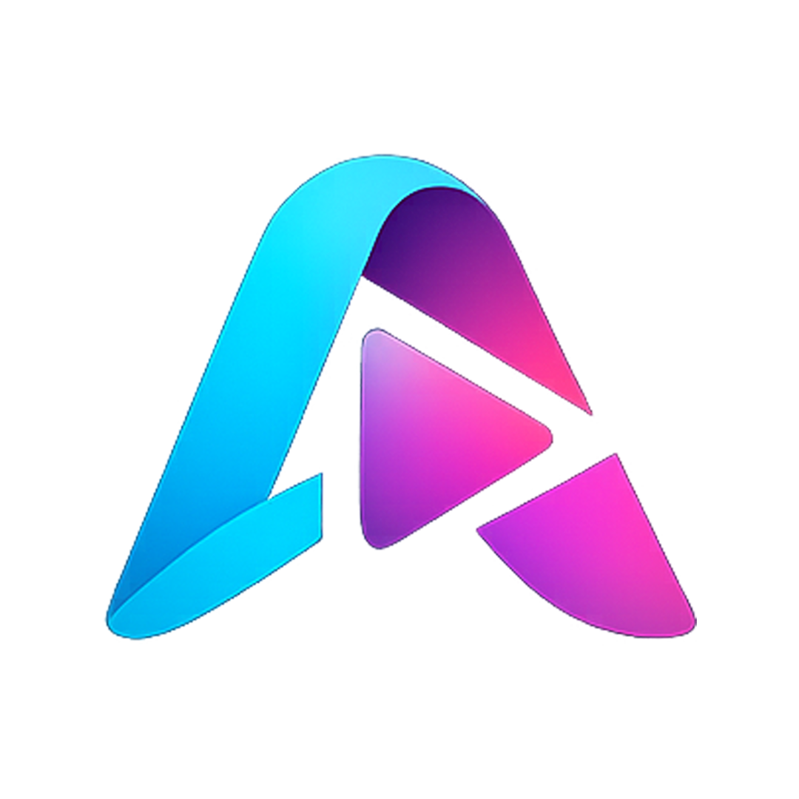

<div align="center">



# Aryo Video Player

### پلیر ویدیویی حرفه‌ای ساخت ایران

[](https://github.com/azar-code-ir/AryoVideoPlayer/stargazers)
[](https://github.com/azar-code-ir/AryoVideoPlayer/network/members)
[](https://github.com/azar-code-ir/AryoVideoPlayer/issues)
[](https://github.com/azar-code-ir/AryoVideoPlayer/releases/latest)
[](LICENSE)
[](https://dotnet.microsoft.com/)

<br/>

**به یاد آریو برزن، سردار دلیر پارسی** 🦁

</div>

---

## 🎬 درباره Aryo Video Player

Aryo Video Player یک پلیر ویدیویی حرفه‌ای و سبک برای ویندوز است که با تکنولوژی‌های مدرن ساخته شده. این پلیر به افتخار **آریو برزن**، سردار بزرگ ایرانی که در نبرد دربند پارس در برابر اسکندر مقدونی ایستادگی کرد، نامگذاری شده است.

---

## ✨ ویژگی‌ها

### 🎥 پخش ویدیو
- پخش تمام فرمت‌های رایج: MP4, MKV, AVI, MOV, WMV, FLV, WebM
- پشتیبانی از کدک‌های مدرن: H.264, H.265/HEVC, VP9, AV1
- پخش صاف و بدون لگ با استفاده از GPU

### 🖥️ نمایش
- **تمام صفحه واقعی** با مخفی کردن تسک‌بار
- **حالت سینمایی** (پس‌زمینه مشکی مطلق)
- **حالت شب** برای تماشا در تاریکی
- نسبت تصویر: 16:9, 4:3, 2.35:1, و سفارشی

### 📝 زیرنویس
- زیرنویس دو زبانه
- تاخیر و جلو/عقب زدن زیرنویس
- پشتیبانی از فرمت‌های SRT, ASS, SUB
- ترجمه آنلاین زیرنویس

### 🎛️ کنترل پیشرفته
- کنترل سرعت: 0.25x تا 4x
- قاب به قاب (Frame Advance)
- پرش به زمان دلخواه
- تکرار ویدیو و لیست پخش
- پخش تصادفی

### 📋 لیست پخش
- مدیریت آسان لیست پخش
- ذخیره و بارگذاری فایل M3U
- افزودن فایل‌ها با Drag & Drop

### 📷 ابزارها
- اسکرین‌شات از ویدیو
- گفتار به متن (Speech to Text)
- اطلاعات فایل ویدیویی

### ⌨️ کلیدهای میانبر

| کلید | عملکرد |
|------|--------|
| `F11` / `Enter` | تمام صفحه |
| `Space` | پخش / توقف |
| `→` `←` | جلو ۱۰ ثانیه / عقب ۱۰ ثانیه |
| `↑` `↓` | افزایش / کاهش صدا |
| `N` | حالت شب |
| `C` | حالت سینمایی |
| `E` | قاب به قاب |
| `R` | تغییر نسبت تصویر |
| `T` | تنظیم تاخیر زیرنویس |
| `L` | تکرار |
| `Ctrl+G` | پرش به زمان |
| `Ctrl+S` | اسکرین‌شات |
| `Ctrl+O` | باز کردن فایل |
| [`] ` | کاهش / افزایش سرعت |
| `PageUp` / `PageDown` | ویدیوی قبلی / بعدی |

> لیست کامل کلیدها: راهنما > کلیدهای میانبر

---

## 📸 اسکرین‌شات‌ها

<div align="center">

*به زودی اسکرین‌شات‌ها اضافه میشوند*

</div>

---

## 🛠️ تکنولوژی‌ها

| تکنولوژی | نسخه | توضیح |
|----------|------|-------|
| .NET | 9.0 | فریمورک اصلی |
| WPF | - | رابط کاربری |
| LibVLCSharp | 3.9.7 | موتور پخش ویدیو |
| VideoLAN.LibVLC | 3.0.23 | کتابخانه بومی VLC |
| Vosk | 0.3.38 | تشخیص گفتار |
| Newtonsoft.Json | 13.0.4 | پردازش JSON |

---

## 📦 دانلود و نصب

### روش ۱: دانلود مستقیم
1. به [آخرین نسخه](https://github.com/azar-code-ir/AryoVideoPlayer/releases/latest) بروید
2. فایل `AryoVideoPlayer_Setup_x.x.x.exe` را دانلود کنید
3. اجرا و نصب کنید

### روش ۲: بیلد از سورس
```bash
# کلون کردن پروژه
git clone https://github.com/azar-code-ir/AryoVideoPlayer.git
cd AryoVideoPlayer

# بیلد
dotnet build -c Release

# یا Publish
dotnet publish -c Release -r win-x64 --self-contained false
```

### پیش‌نیازها
- ویندوز ۱۰ یا ۱۱ (۶۴ بیت)
- .NET 9.0 Runtime

---

## 📁 ساختار پروژه

```
AryoVideoPlayer/
├── App.xaml / App.xaml.cs          # نقطه شروع برنامه
├── MainWindow.xaml / .cs           # پنجره اصلی و منطق
├── DarkMessageBox.xaml / .cs       # پیام باکس سفارشی
├── AudioToTextWindow.xaml / .cs    # پنجره گفتار به متن
├── LanguageSelectionWindow.xaml    # انتخاب زبان
├── Assets/                         # آیکون‌ها و تصاویر
├── Fonts/                          # فونت پینار
├── Helpers/
│   ├── AppSettings.cs              # ذخیره تنظیمات
│   ├── SrtParser.cs                # پردازش زیرنویس
│   ├── TranslationService.cs       # ترجمه آنلاین
│   └── UpdateChecker.cs            # بررسی بروزرسانی
├── Models/
│   └── SubtitleEntry.cs            # مدل زیرنویس
└── setup.iss                       # اسکریپت اینستالر
```

---

## 🤝 مشارکت

ما از مشارکت شما استقبال می‌کنیم! لطفاً قبل از ارسال Pull Request، فایل [CONTRIBUTING.md](CONTRIBUTING.md) را مطالعه کنید.

---

## 📄 لاینسس

این پروژه تحت لاینسس **Source Available** است. شما می‌توانید کد منبع را مشاهده و برای استفاده شخصی و غیرتجاری استفاده کنید، اما **تکثیر، توزیع، و استفاده تجاری بدون اجازه کتبی ممنوع است**.

برای اطلاعات بیشتر، فایل [LICENSE](LICENSE) را مطالعه کنید.

---

## 📞 ارتباط با ما

<div align="center">

[](https://t.me/Thesurenax)
[](https://github.com/azar-code-ir)

</div>

---

<div align="center">

**ساخته شده با ❤️ توسط [تیم آذر کد](https://github.com/azar-code-ir)**

به یاد آریو برزن، سردار دلیر پارسی 🦁🔥

</div>
